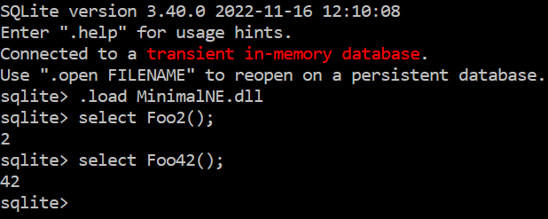
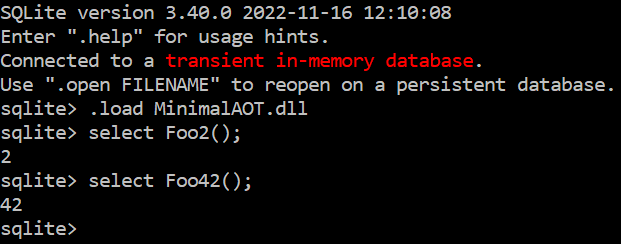
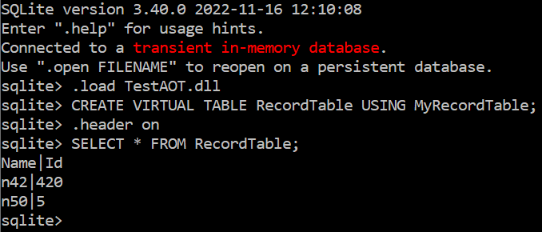
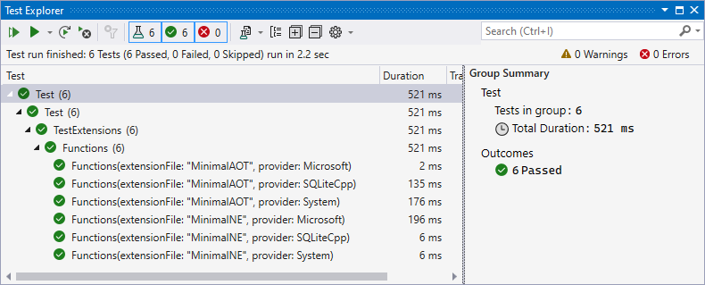

# Sqlite-DNA

Sqlite-DNA supports writing [SQLite extensions](https://www.sqlite.org/loadext.html) with C# and .NET 7.

We use the [DNNE library](https://github.com/AaronRobinsonMSFT/DNNE), [AOT](https://learn.microsoft.com/en-us/dotnet/core/deploying/native-aot/) and [Source Generators](https://learn.microsoft.com/en-us/dotnet/csharp/roslyn-sdk/source-generators-overview) to create a native library exporting the .NET functions.

### Getting started

Visual Studio 2022 with .NET 7 support and .NET desktop development, Desktop development with C++ workloads should be installed.

Create a C# class library .NET 7 project and reference the SqliteDna package (or use Samples\Minimal\Minimal.csproj):

```xml
<Project Sdk="Microsoft.NET.Sdk">

	<PropertyGroup>
		<TargetFramework>net7.0</TargetFramework>
		<ImplicitUsings>enable</ImplicitUsings>
		<Nullable>enable</Nullable>
	</PropertyGroup>

	<ItemGroup>
		<PackageReference Include="SqliteDna" Version="*-*" />
	</ItemGroup>

</Project>
```

Write your custom function and mark it with the [SqliteFunction] attribute:

```csharp
using SqliteDna.Integration;

namespace Minimal
{
    public class MyFunctions
    {
        [SqliteFunction]
        public static int Foo2()
        {
            return 2;
        }

        [SqliteFunction]
        public static int Foo42()
        {
            return 42;
        }
    }
}
```

Build the project. SqliteDna will use DNNE mode and produce 4 files comprising your extension: [ProjectName]NE.dll (native wrapper), [ProjectName].dll (main .NET dll), [ProjectName].runtimeconfig.json, SqliteDna.Integration.dll.

You can now load the extension in SQLite and call the functions:



To use the AOT mode, add PublishAOT and RuntimeIdentifier properties to the project (or use Samples\MinimalAOT\MinimalAOT.csproj):

```xml
<Project Sdk="Microsoft.NET.Sdk">

	<PropertyGroup>
		<TargetFramework>net7.0</TargetFramework>
		<ImplicitUsings>enable</ImplicitUsings>
		<Nullable>enable</Nullable>

		<PublishAOT>true</PublishAOT>
		<RuntimeIdentifier>win-x64</RuntimeIdentifier>
	</PropertyGroup>

	<ItemGroup>
		<PackageReference Include="SqliteDna" Version="*-*" />
	</ItemGroup>

</Project>
```

Publishing the AOT project will produce the single [ProjectName].dll native extension that you can load in SQLite:



You can automatically publish on build, adding the following targets to the project:

```xml
<Target Name="SetNoBuild">
	<PropertyGroup>
		<NoBuild>true</NoBuild>
	</PropertyGroup>
</Target>
<Target Name="PublishAfterBuild" AfterTargets="AfterBuild" DependsOnTargets="SetNoBuild;Publish" />
```

### Features

You can use int, long, double, string, string?, DateTime, Guid, byte[], byte[]? types for your function parameters and return value. They will be automatically converted to corresponding SQLite types.

DateTime can be constructed from ISO-8601, Julian day, and unix timestamp formats. Returned DateTime is converted to an SQLite string.

Guid can be constructed from text and binary formats. Returned Guid is converted to an SQLite string.

You can throw an exception from your function and it will be converted to an SQLite error.

### Virtual tables

You can write a function generating table data returning IEnumerable. The following function generates a table with a single column Value and two rows: 

```csharp
[SqliteTableFunction]
public static IEnumerable<string> MyStringTable()
{
    List<string> result = new List<string> { "str1", "str2" };
    return result;
}
```

Then you can invoke it from SQLite:

```sql
CREATE VIRTUAL TABLE StringTable USING MyStringTable
```

Returning a custom type from SqliteTableFunction allows you to create a table with a column for each public property of the type:

```csharp
public record CustomRecord(string Name, int Id);

[SqliteTableFunction]
public static IEnumerable<CustomRecord> MyRecordTable()
{
    List<CustomRecord> result = new List<CustomRecord> { new CustomRecord("n42", 420), new CustomRecord("n50", 5) };
    return result;
}
```



You can accept parameters in SqliteTableFunction:

```csharp
[SqliteTableFunction]
public static IEnumerable<CustomRecord> MyRecordParamsTable(string name, int id)
{
    List<CustomRecord> result = new List<CustomRecord> { new CustomRecord(name, id) };
    return result;
}
```

And provide parameters from SQLite:

```sql
CREATE VIRTUAL TABLE RecordParamsTable USING MyRecordParamsTable("Hello, world!", 100)
```

### Dynamic virtual tables

If you provide a virtual table and its schema is not known at compile time, you should return a DynamicTable object from the SqliteTableFunction.

The Samples\CsvReader project demonstrates how to implement a .csv file reader when the table data and columns are specified at runtime:

```sql
CREATE VIRTUAL TABLE Catalonia USING csv(crash_catalonia.csv, "Day_of_Week text, Number_of_Crashes integer")
```

In the csv function we extract column types from the provided schema, parse .csv data according to the extracted types, return the provided schema and the extracted data as a DynamicTable object:

```csharp
[SqliteTableFunction]
public static DynamicTable csv(string filename, string schema)
{
    var types = schema.Split(',').Select(i => i.Split(' ', StringSplitOptions.RemoveEmptyEntries | 
        StringSplitOptions.TrimEntries).Last()).ToArray();

    List<object[]> dataResult = new();
    foreach (string line in File.ReadAllLines(filename))
    {
        var values = line.Split(',').ToArray();

        var valuesArray = new object[values.Length];
        for (int i = 0; i < values.Length; ++i)
        {
            switch (types[i])
            {
                case "integer":
                    valuesArray[i] = long.Parse(values[i]);
                    break;
                case "real":
                    valuesArray[i] = double.Parse(values[i]);
                    break;
                case "text":
                    valuesArray[i] = values[i].Replace("\"","");
                    break;
            }
        }
        dataResult.Add(valuesArray);
    }

    return new(schema, dataResult);
}
```

### Testing

You can easily test your extension in SQLite using the SqliteDna.Testing package.

Create an xUnit test project and add a reference to SqliteDna.Testing (or use Samples\Test\Test.csproj):

```xml
<Project Sdk="Microsoft.NET.Sdk">

  <PropertyGroup>
    <TargetFramework>net7.0</TargetFramework>
    <ImplicitUsings>enable</ImplicitUsings>
    <Nullable>enable</Nullable>

    <IsPackable>false</IsPackable>
    <IsTestProject>true</IsTestProject>
  </PropertyGroup>

  <ItemGroup>
    <PackageReference Include="SqliteDna.Testing" Version="*-*" />
	  
    <PackageReference Include="Microsoft.NET.Test.Sdk" Version="17.6.0" />
    <PackageReference Include="xunit" Version="2.4.2" />
    <PackageReference Include="xunit.runner.visualstudio" Version="2.4.5">
      <IncludeAssets>runtime; build; native; contentfiles; analyzers; buildtransitive</IncludeAssets>
      <PrivateAssets>all</PrivateAssets>
    </PackageReference>
    <PackageReference Include="coverlet.collector" Version="3.2.0">
      <IncludeAssets>runtime; build; native; contentfiles; analyzers; buildtransitive</IncludeAssets>
      <PrivateAssets>all</PrivateAssets>
    </PackageReference>
  </ItemGroup>

</Project>
```

Specify your extension(s) .dll name(s) in GenerateConnectionParameters call, create SqliteConnection, call your functions using the connection and assert results as usual:

```csharp
using SqliteDna.Testing;

namespace Test
{
    public class TestExtensions
    {
        [Theory, MemberData(nameof(ConnectionData))]
        public void Functions(string extensionFile, SqliteProvider provider)
        {
            using (var connection = SqliteConnection.Create("Data Source=:memory:", extensionFile, provider))
            {
                Assert.Equal(2, connection.ExecuteScalar<long>("SELECT Foo2()"));
                Assert.Equal(42, connection.ExecuteScalar<long>("SELECT Foo42()"));
            }
        }

        public static IEnumerable<object[]> ConnectionData => 
            SqliteConnection.GenerateConnectionParameters(new string[] { "MinimalNE", "MinimalAOT" });
    }
}
```

You also need to copy extension .dlls to the Test project output, for example adding the following PostBuildEvent to the Test project:

```xml
<Target Name="PostBuild" AfterTargets="PostBuildEvent">
	<Exec Condition=" '$(OS)' == 'Windows_NT' " Command="xcopy /y $(SolutionDir)Minimal\bin\$(ConfigurationName)\net7.0\Minimal.dll $(TargetDir)&#xD;&#xA;xcopy /y $(SolutionDir)Minimal\bin\$(ConfigurationName)\net7.0\MinimalNE.dll $(TargetDir)&#xD;&#xA;xcopy /y $(SolutionDir)Minimal\bin\$(ConfigurationName)\net7.0\Minimal.runtimeconfig.json $(TargetDir)&#xD;&#xA;xcopy /y $(SolutionDir)Minimal\bin\$(ConfigurationName)\net7.0\SqliteDna.Integration.dll $(TargetDir)&#xD;&#xA;xcopy /y $(SolutionDir)MinimalAOT\bin\$(ConfigurationName)\net7.0\win-x64\publish\MinimalAOT.dll $(TargetDir)" />
</Target>
```

And add Build Dependencies - Project Dependencies for the Test project on your extension project(s), to execute PostBuildEvent after extension .dll files are ready. See Samples.sln as an example:

```xml
Project("{9A19103F-16F7-4668-BE54-9A1E7A4F7556}") = "Minimal", "Minimal\Minimal.csproj", "{62096343-8461-4DE8-A23C-F0FB07B517EA}"
EndProject
Project("{9A19103F-16F7-4668-BE54-9A1E7A4F7556}") = "MinimalAOT", "MinimalAOT\MinimalAOT.csproj", "{3449A6FB-FF36-42DF-AC5C-82F098DDA924}"
EndProject
Project("{FAE04EC0-301F-11D3-BF4B-00C04F79EFBC}") = "Test", "Test\Test.csproj", "{3AF2C048-D2DD-4D21-A1B3-B95D8A87DC2A}"
	ProjectSection(ProjectDependencies) = postProject
		{3449A6FB-FF36-42DF-AC5C-82F098DDA924} = {3449A6FB-FF36-42DF-AC5C-82F098DDA924}
		{62096343-8461-4DE8-A23C-F0FB07B517EA} = {62096343-8461-4DE8-A23C-F0FB07B517EA}
	EndProjectSection
EndProject
```

Running the tests, your extension will be loaded and called in SQLite using Microsoft.Data.Sqlite, System.Data.SQLite and SQLiteC++ providers:



long, double, string, DBNull, DateTime, byte[], Guid can be used as connection.ExecuteScalar type parameter.

connection.ExecuteNonQuery can be used to call functions not returning anything.

connection.ExecuteReader can be used to read multiple values from a query:

```csharp
Assert.Equal(0, connection.ExecuteNonQuery("CREATE VIRTUAL TABLE RecordTable USING MyRecordTable"));
using (var reader = connection.ExecuteReader("SELECT Name, Id FROM RecordTable"))
{
    Assert.True(reader.Read());
    Assert.Equal("n42", reader.GetItem<string>("Name"));
    Assert.Equal(420, reader.GetItem<long>("Id"));
    Assert.True(reader.Read());
    Assert.Equal("n50", reader.GetItem<string>("Name"));
    Assert.Equal(5, reader.GetItem<long>("Id"));
}
```

You can run your extension only in one provider using specific connection parameters like this:

```csharp
public static IEnumerable<object[]> SystemConnectionData => 
    SqliteConnection.GenerateConnectionParameters(new string[] { "TestDNNENE", "TestAOT" }, SqliteProvider.System);
```

And you can check SqliteProvider provider value in test code if there is difference in provider behavior:

```csharp
using (var connection = SqliteConnection.Create("Data Source=northwind.db", extensionFile, provider))
{
    {
        string commandText = "SELECT HireDate FROM Employees WHERE EmployeeId = 9";
        string result = provider switch
        {
            SqliteProvider.System => connection.ExecuteScalar<DateTime>(commandText).ToString("yyyy-MM-dd HH:mm:ss.FFF", CultureInfo.InvariantCulture),
            _ => connection.ExecuteScalar<string>(commandText),
        };
        string expected = provider switch
        {
            SqliteProvider.System => "2014-11-15 00:00:00",
            _ => "2014-11-15",
        };
        Assert.Equal(expected, result);
        Assert.Equal("2014-11-15 00:00:00", connection.ExecuteScalar<string>("SELECT DateTimeNop(HireDate) FROM Employees WHERE EmployeeId = 9"));
    }
}
```

### Related projects

* https://observablehq.com/@asg017/introducing-sqlite-loadable-rs
* https://github.com/nalgeon/sqlean
* https://github.com/x2bool/xlite
* https://sqlsharp.com/features/
* https://github.com/tcdi/pgx - Build PostgreSQL extensions with Rust
* https://learn.microsoft.com/en-us/azure/postgresql/single-server/concepts-extensions - List of PostgreSQL extensions available in Azure
* https://observablehq.com/@asg017/introducing-sqlite-vss
